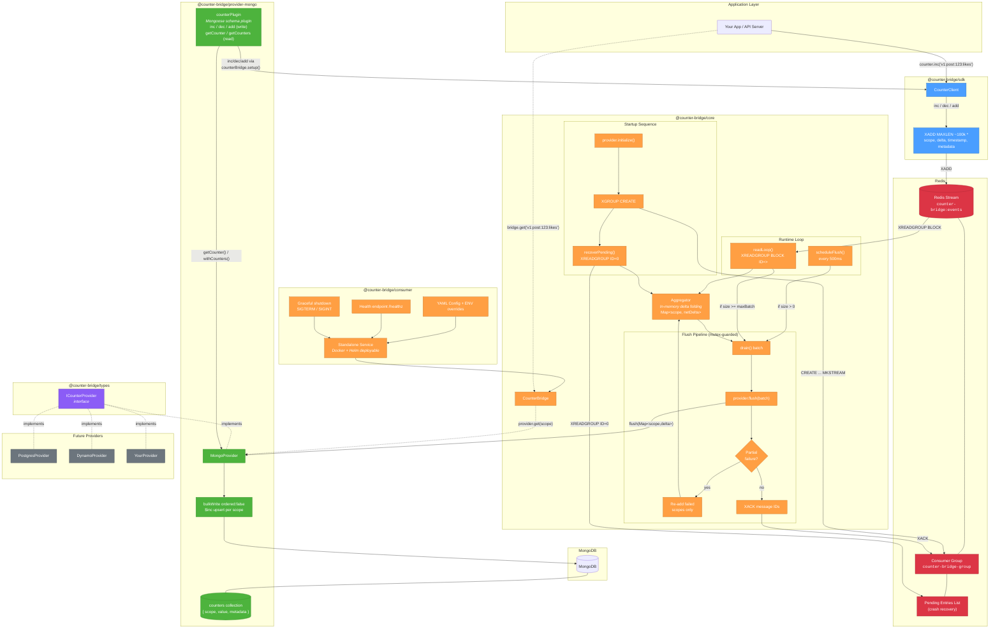
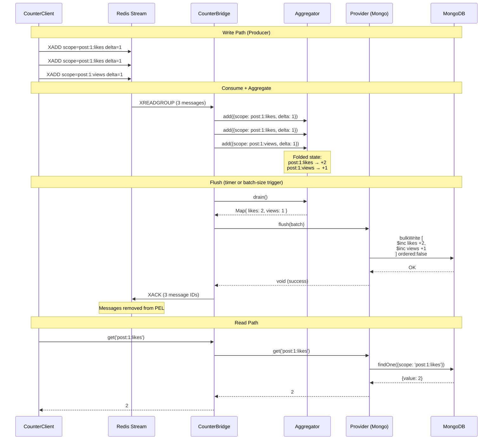
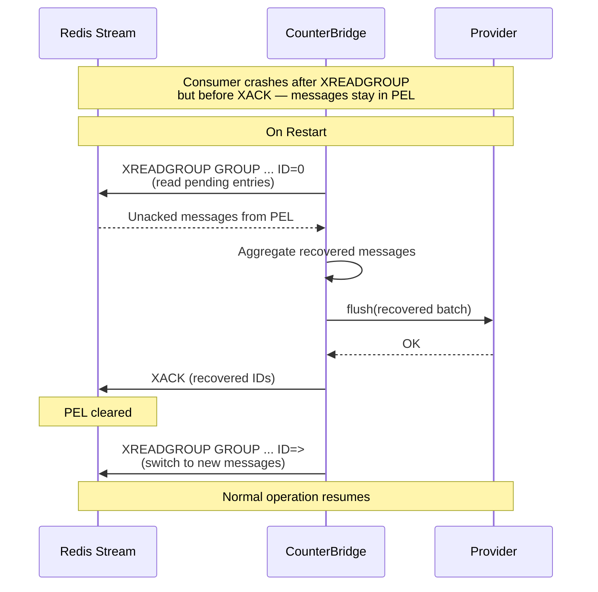
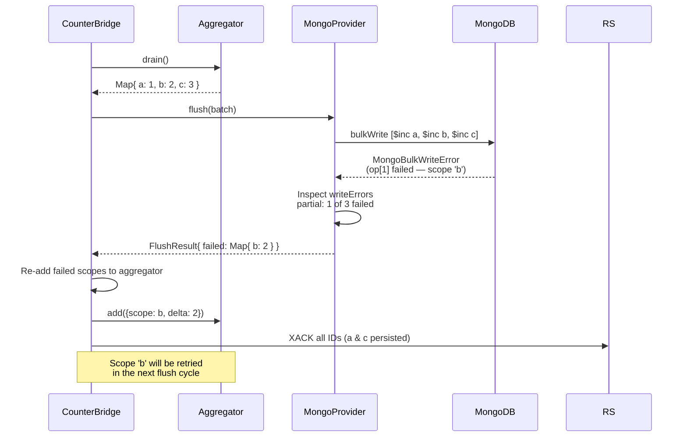
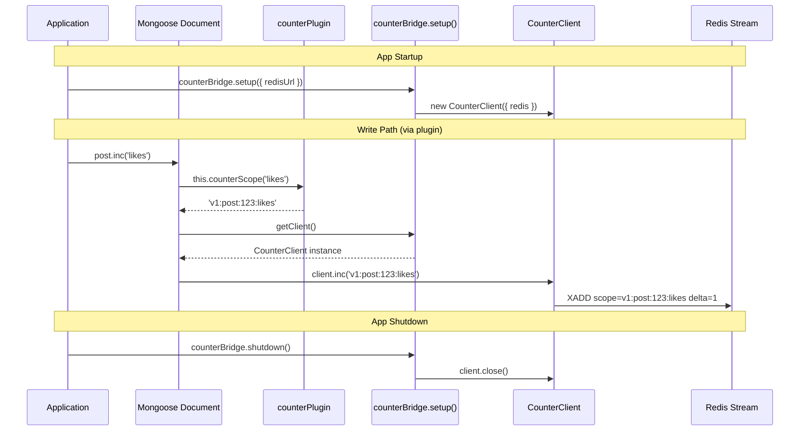
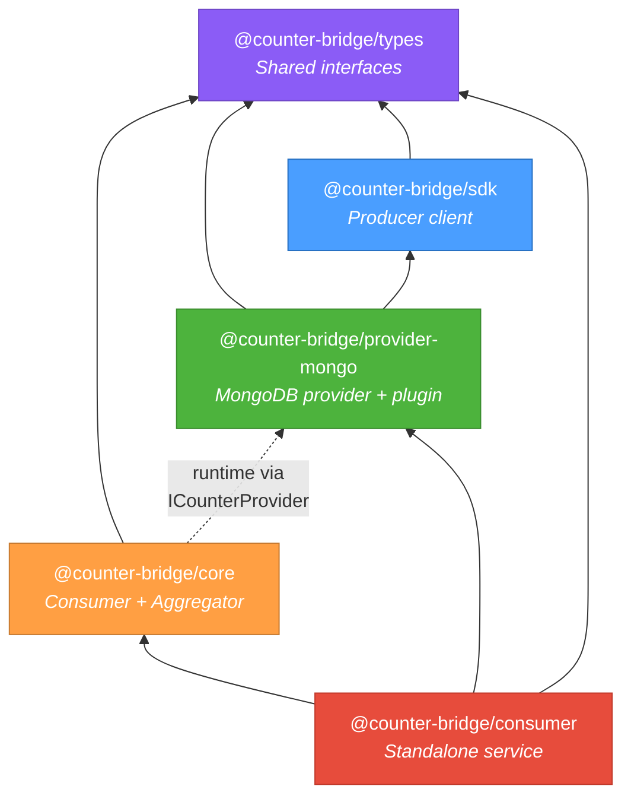

# CounterBridge Architecture

## System Overview

## At-Least-Once Delivery Guarantee

## Crash Recovery (PEL)

## Partial Flush Failure Handling

## Plugin Write Flow

## Package Dependency Graph

